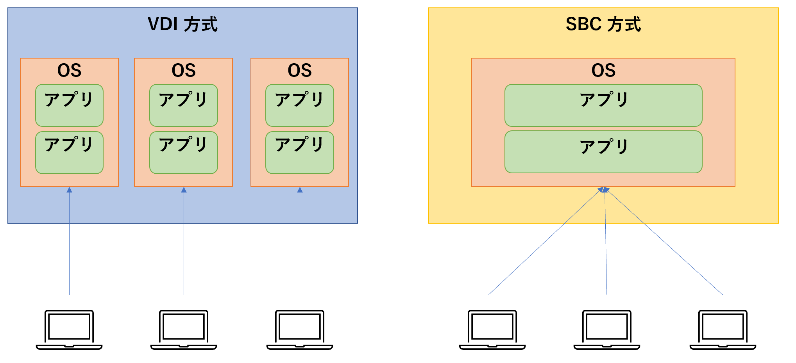
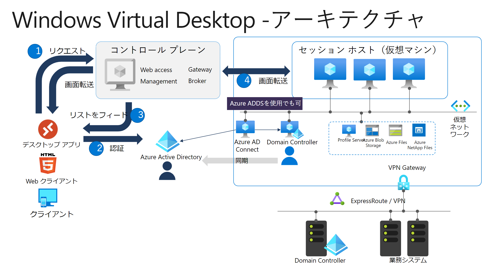
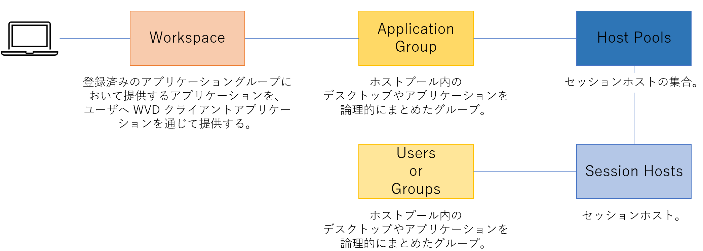
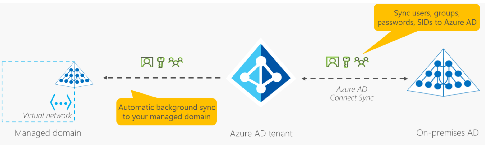
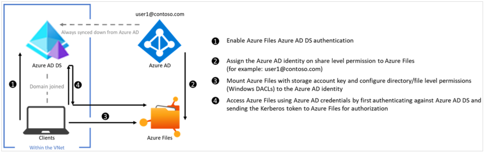
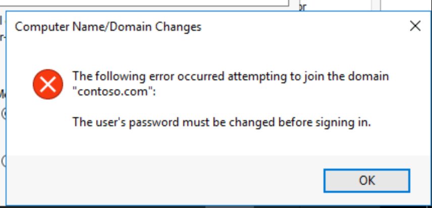
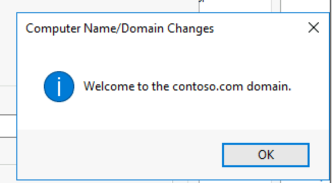
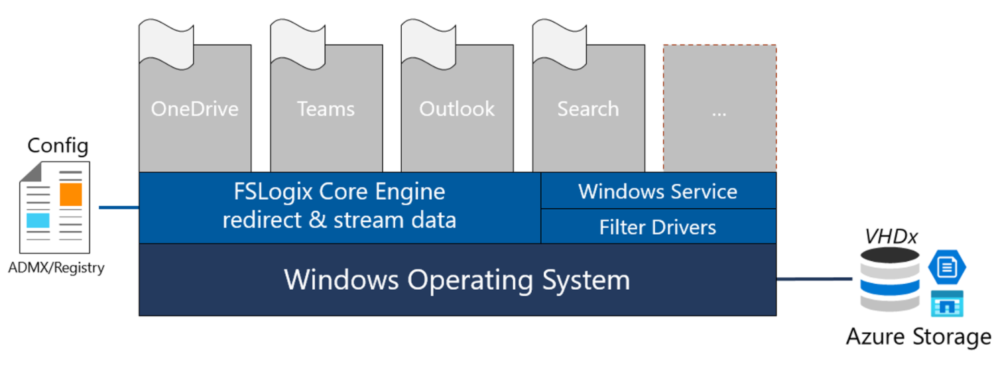
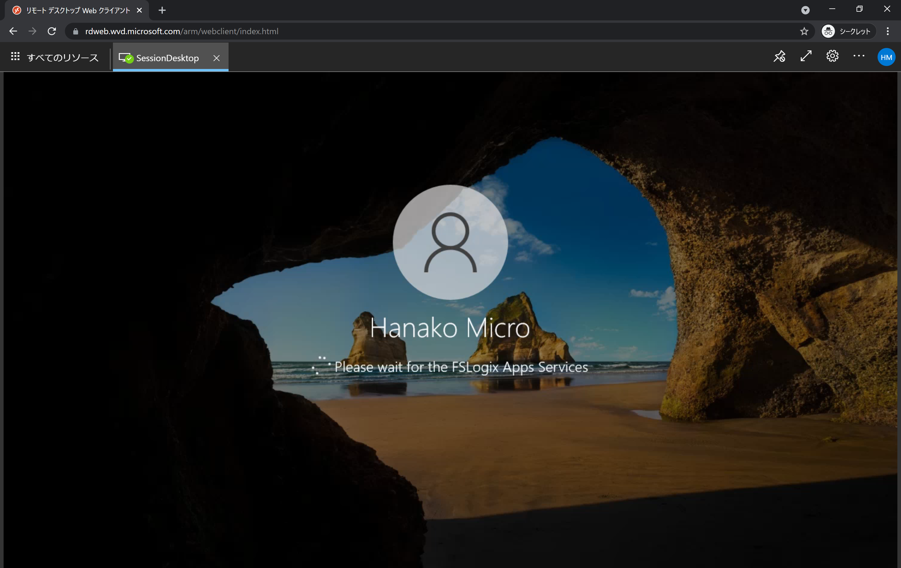

# Windows Virtual Desktop

## 目的
- Windows Virtual Desktop (WVD) を構築し、アーキテクチャを把握する。

## 前提
- Azure サブスクリプションを保有していること（<b>※ Azure ADDS の課金が月額約 ￥13,000 いくため、課金には注意が必要</b>）。

## 2 種類のデスクトップ仮想化方式
以下のように、「仮想デスクトップ」には 2 つの形態が存在する。



### A. VDI 方式
仮想サーバ上に作成された仮想デスクトップを 1 ユーザごとに 1 台ずつ割り当てる方式。<br>

#### メリット
 - 物理 PC とほぼ同等の自由度の高いパフォーマンスを発揮する。
 - 特定のユーザの処理が他のユーザに影響しない。

#### デメリット
 - 1 人 1 台なので、コストが高い。

### B. SBC 方式
サーバ OS 上のアプリなどを複数のユーザで共有して使用する方式。

#### メリット
 - コストを抑えることができる。
 - 端末ごとのバージョン管理が不要。

#### デメリット
 - サーバ OS をクライアントとして使用するため、そもそもの用途が異なり、自由度が下がる。

## WVD 全体像
アーキテクチャは下図の通り。



WVD には、下図のような概念がある。



### ホストプール : Host pools
ホストプールは、セッションホスト（VM）の集合を指す。<br>
ホストプールには、以下の 2 形態が存在する。

| タイプ | 概要 |
| :---: | :--- |
| Personal | 各セッションホストに対してユーザを 1 対 1 で紐づける。<br>自動割り当てオプションの選択が可能。 |
| Pooled | 1 つのセッションホストを複数のユーザで利用する。 |

Pooled にすると、 1 つの VM に対する最大同時ユーザ数を設定する必要がある。最大同時ユーザ数を設定後、ホストプールの負荷分散方法を選択する。

負荷分散方法は下記の通り設定が可能。

| モード | 概要 |
| :--- | :--- |
| 軸優先モード | ユーザが全ての VM に均等にログオンする。つまり、 1 人目のユーザは VM 1 にログオンし、 2 人目のユーザは VM 2 にログオンする、といった具合で負荷分散する。 |
| 深さ優先モード | 設定した最大同時ユーザ数が VM 1 にログオンするまで、他の VM にはログオンしない。 |

### アプリケーショングループ：Application Groups
ホストプール内のデスクトップやアプリケーションを論理的にまとめた集合を指す。

### Windows 10 マルチセッション
1 台の VM に対し、複数のユーザが接続可能な VDI 方式の環境を構築可能。 VDI 方式と SBD 方式のいいとこ取りをするイメージ（ SBC のようにコストを節約しつつ、 VDI のように高い自由度も実現可能）。

## 検証
以下の条件で検証を行う。

### ユーザ
AD 管理用ユーザを 1 名、検証用ユーザを 2 名用意する。

| Username | Role |
| :---: | :---: |
| mgr | 管理者 |
| hanako | 利用者 1 |
| taro | 利用者 2 |

### 手順
手順は下記の通り。

#### リソースグループの作成
通常通り、リソースグループを作成。

#### 仮想ネットワークの作成
通常通り、仮想ネットワークを作成。

#### Azure AD Domain Service (AADS) の作成
WVD の利用には、セッションログイン用に、 Azure AD に加えて、ドメインサービスが必要となる。<br>
これは、セッションホストをドメインに参加させる必要があるものの、 Azure AD は IaaS (今回の場合、セッションホスト) の認証に対応していないためである。<br>
ドメインサービス（Active Directory Domain Services）を IaaS 上に構築することも可能だが、検証用でサクッと構築するため、今回は PaaS である Azure AD Domain Services を使用する。

### 詳細情報

#### Azure Active Directory Domain Services の Managed Domain 内でのオブジェクトと資格情報の同期の仕組み ★（設計思想、要確認）

- OnP から Azure AD 間は、 Azure AD Connect を使用して、 OnP の AD DS ドメインのオブジェクトと資格情報を Azure AD に Sync 可能。
- Azure AD から Azure AD DS に対しては、一方向 ( Azure AD -> Azure AD DS ) のみ Sync 可能。逆方向は不可能。
- Managed Domain 内で直接リソースを作成することはできるが、 Azure AD に同期されないため、注意が必要。



[参考](https://docs.microsoft.com/ja-jp/azure/active-directory-domain-services/synchronization?WT.mc_id=Portal-Microsoft_AAD_DomainServices)

#### グループ作成

Azure AD に、WVD を利用可能なユーザのグループ（`WVD_Users`）を作成する。

#### ユーザ作成

| Username | 名前 | グループ |
| :---: | :---: | :---: |
| mgr | AD Manager | AAD DC Administrators | KK31108424#5
| hanako | Hanako Micro | WVD_Users |
| taro | Taro Micro | WVD_Users |

#### Azure Files (プロファイル保管用ファイルサーバ)作成

ストレージアカウント作成 > Azure AD DS ユーザからのアクセス許可設定（Azure Files の ID ベースの承認を有効化）

Azure Files にて、 ID ベースの承認を有効化する場合の一般的なユースケースは下記の通り。

- OnP のファイルサーバの置換
- Azure へのアプリケーションの Lift & Shift
- バックアップと DR

Azure File Share にてサポートされる認証シナリオは下記の通りである。

| Azure AD DS 認証 | オンプレミス AD DS 認証 |
| :--- | :--- |
|Azure AD DS に参加済みの Windows マシンは、SMB 経由で Azure AD 資格情報を使用して Azure ファイル共有にアクセス可能。 | オンプレミス AD DS に参加済みまたは Azure AD DS に参加済みの Windows マシンは、SMB 経由で Azure AD に同期されるオンプレミス Active Directory 資格情報を使用して Azure ファイル共有にアクセス可能。 クライアントには、AD DS への通信経路が必要。|

今回のシナリオでは、セッションホストがドメインに参加する必要があるため、 Azure AD DS を Azure 上にセットアップする必要がある（[参考](https://docs.microsoft.com/ja-jp/azure/storage/files/storage-files-active-directory-overview)）。

Azure File Share では、 OnP の AD DS または Azure AD DS での認証に、Kerberos を使用する（[勉強会資料](https://speakerdeck.com/kohei3110/kerberosren-zheng-nituiteli-jie-woshen-meru)）。Credential を交換することなく、 Token による認証・認可を実現可能。

Azure File Share で ID ベースの認証を有効化するためには、 Azure AD DS にて認証を行う場合、ファイルデータのアクセスもととなる VM (今回のシナリオの場合は、セッションホスト)をドメイン参加させる必要がある。また、ドメイン参加する VM は、 Azure AD DS と同一仮想ネットワーク上に存在する必要がある。



①：Azure Files にて、 Azure AD DS 認証を有効化<br>
②：バックグラウンドプロセスにて、ストレージアカウントを表す Azure AD DS での ID を作成（ユーザから行う必要はない）<br>
③：Azure Files をマウント（ DACL 適用）<br>
④：Azure AD DS にて認証後、取得した Kerberos Token を使って Azure Files へアクセス

#### グループポリシーの設定

##### 管理用 Windows Server VM の作成

管理用 VM から読みに行く DNS サーバの設定が不適切だと、下記のエラーメッセージが出力される。

```
The error was: “DNS name does not exist.”

(error code 0x0000232B RCODE_NAME_ERROR)
The query was for the SRV record for _ldap._tcp.dc._msdcs.saqibullah.com
Common causes of this error include the following:

– The DNS SRV records required to locate a AD DC for the domain are not registered in DNS. These records are registered with a DNS server automatically when a AD DC is added to a domain. They are updated by the AD DC at set intervals. This computer is configured to use DNS servers with the following

IP addresses:

・・・
```

あらかじめ Azure Portal にて DNS サーバの設定を更新すれば、下記のエラーに躓くことはない（[参考](https://qiita.com/takeokams/items/ef26b60306d1cb5eee27#azure-ad-domain-services%E3%81%AE%E4%BD%9C%E6%88%90)）。ただし、この設定を怠った場合、 VM 上で DNS サーバの設定変更を行うと、ネットワークの問題が生じ、 Bastion 経由で VM に接続することができなくなってしまった。原因は不明だが、 Managed Service であるため、設定は可能な限り Azure Portal から行うのがよいだろう。

また、作成したユーザで初回ログイン時は、あらかじめパスワードを変更する必要がある。パスワードを変更せずにログインしようとすると、ドメイン参加時に下図のようなエラーメッセージが出力される。



ドメイン参加に成功すると、下記メッセージが出力される。



ドメイン参加後、 VM は再起動する必要がある。

##### Group Policy Management 機能の追加

構築した Windows Server を管理用とするため、Group Policy Management 機能を追加する。

##### FSLogix のポリシー設定

Windows 10 Multi-session にとって重要な機能である、ユーザプロファイルの管理機能を保有している FSLogix を[ここ](https://aka.ms/fslogix_download)からダウンロードし、下記のようにコピーする。

| ファイル | コピー先 |
| :--- | :--- |
| fslogix.admx | C:\Windows\PolicyDefinitions |
| fslogix.adml | C:\Windows\PolicyDefinitions\en-US |

ユーザプロファイルは、共有型の場合、ユーザがログインする VM (セッションホスト)は毎回同一とは限らないため、ユーザプロファイルをリモートに保存する必要がある。<br>
ただし、ユーザプロファイルをリモートに保存すると、ロードが遅いためデスクトップ表示に時間がかかるなどの課題が残っていた（ユーザプロファイルは大きい場合が多いため、リモートからファイルをコピーすると、遅延が発生するなどの問題が生じていた）。
FSLogix コンテナを使用すると、ユーザプロファイルはネットワーク上の場所（Azure Storage）にリダイレクトされ、実行時にマウントされる。これにより、ファイルをコピーする必要がなくなるため、高速にユーザプロファイルの読み出しが可能となる。



FSLogix コンテナを使用するためには、[サービス](https://meaning-difference.com/?p=12087)エージェントを VDI イメージにインストールする必要がある。インストール完了後、[フィルタードライバー](https://docs.microsoft.com/ja-jp/windows-hardware/drivers/kernel/filter-drivers)が OS に組み込まれる（ = デバイスに付加価値を追加する）。その後、適切なレジストリ（ `fslogix.admx` / `fslogix.adml` ）を設定し、VHDx コンテナをファイルシステムや SMB 共有の場所に配置可能となる。

`*.admx` / `*.adml` については、ポリシー設定用のファイルという理解でよい（[参考](https://docs.microsoft.com/ja-jp/troubleshoot/windows-client/group-policy/create-and-manage-central-store)）。

<b>FSLogix のポリシーを設定するためには、mgr@contoso.com でログインする必要がある。</b><br>
（特に踏み台へのユーザ追加は不要。。）★理由要調査

##### タイムゾーンのリダイレクト設定

クライアントのタイムゾーンに仮想デスクトップの時刻を合わせる設定を行う。

#### セッションホスト用のマスターイメージ作成

今回は、Windows 10 multi-session を利用する。

##### Sysprep

Sysprep とは、端末固有の情報を初期化して、その端末のディスクイメージをほかの端末に展開できるように準備するためのプログラムのこと。今回は、イメージを汎用化するために、管理者モードのコマンドラインから、下記のように実行する。終了後、自動的に仮想マシンが Shutdown される。

```shell
C:\Windows\System32\Sysprep\sysprep.exe /generalize /oobe /shutdown
```

#### WVD 環境構築

ようやく WVD 環境構築を行う。

今回はセッションホストを東日本リージョンにデプロイするため、ホストグループを作成する際に、 VM サイズとして、東日本リージョンで作成可能なものを指定する必要がある。この設定を怠ると、下記のエラーが出力される（[参考](https://docs.microsoft.com/ja-jp/azure/azure-resource-manager/templates/error-sku-not-available)）。

```
Code: SkuNotAvailable
Message: The requested tier for resource '<resource>' is currently not available in location '<location>'
for subscription '<subscriptionID>'. Please try another tier or deploy to a different location.
```

ホストプールのデプロイ後、作成されたアプリケーショングループに対し、利用可能なユーザ / グループを登録する。今回は、 `WVD_Users` グループを追加する。

以下の図の関係性が構築できていないと、ユーザから WVD を参照できない。


WVD Web Client は、[こちら](https://rdweb.wvd.microsoft.com/arm/webclient)からアクセス可能。

下図のように、接続に成功する。



デスクトップ版の Client も[こちら](https://go.microsoft.com/fwlink/?linkid=2068602)からダウンロード可能。

## 参考
- [サクッと検証用Windows Virtual Desktopを構築](https://qiita.com/takeokams/items/ef26b60306d1cb5eee27)

## Q&A
- Blob をプロファイル保管用ストレージとして採用するメリットはあるか？
    - 安価。設計次第で構成できなくはないが、性能やシンプルさを優先するのであれば、Azure Files や Azure NetApp Files (ANF) を選択するのもあり。